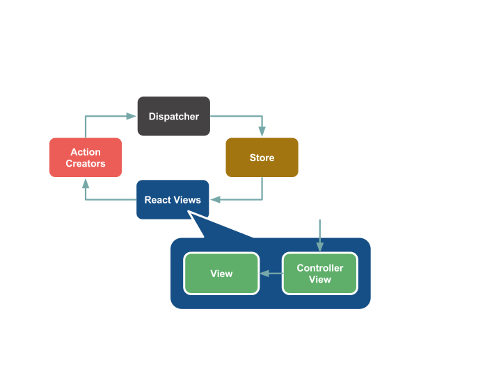

[Draft]

# Flux

## 今回の趣旨

前回に作成したReactによるカウンターアプリケーションをFluxを使って実装してみる。

Fluxの実装にはfacebookのfluxを利用するが、あくまでアーキテクチャの構成要素やフローを確認する目的にとどめ、
個別のFluxフレームワーク実装のAPIにはこだわらないようにする。

Counterコンポーネントは前回Reactによる実装で作成したCounterクラスを再利用する。


## Fluxの登場人物



### Action Creators

アプリケーションの状態を変更するためのActionを作る。

### Dispatcher

Actionを受け取ってStoreに配る。

### Store

アプリケーションのすべての状態を保持し、ビジネスロジックを持つ。


### Controller View

Storeの変更を受け取り内部のViewに渡す。


## 実装（セットアップ的なところまで）

### Dispatcher

Dispatcherはfluxのものをそのまま利用する。

### Store

アプリケーションの状態を持つStoreを作成する。

src/flux/CounterStore.js
```javascript
import { Store } from 'flux/utils';

export default class CounterStore extends Store {

  constructor(dispatcher) {
    super(dispatcher);
    this._count = 0;
  }

  getState() {
    return {
      count: this._count
    };
  }

}
```

### App (Controller View)

アプリケーションのビューの親玉。

src/flux/App.js
```javascript
import React from 'react';
import Counter from '../components/Counter';

export default class App extends React.Component {

  constructor(props) {
    super(props);
    const { store } = props;
    this.state = store.getState();
    store.addListener(() => {
      this.setState({
        count: store.getCount()
      });
    });
  }

  render() {
    const { count } = this.state;
    return (
      <Counter count={count}
        onClickMinus={this.handleMinus.bind(this)}
        onClickPlus={this.handlePlus.bind(this)} />
    );
  }

  handlePlus() {

  }

  handleMinus() {

  }
}
```

### エントリポイント

Dispatcherのインスタンス生成とStoreのインスタンス生成。
AppにStoreのインスタンスを渡すところまでやって準備。

src/app-flux.js
```javascript
import React from 'react';
import { render } from 'react-dom';

import { Dispatcher } from'flux';
import CounterStore from './flux/CounterStore';
import App from './flux/App';

const dispatcher = new Dispatcher();
const store = new CounterStore(dispatcher);

render(
  <App store={store} />,
  document.getElementById('app')
);
```

ここまででStoreの持つ状態を初期描画するまでが完了。


## データの流れとアクションを作る

まずは"+"ボタンが押された時の流れで考える。

### アクションを定義

アクションのタイプはActionCreatorとStoreで使うことになるのでconstantsにまとめておく。

src/flux/constants.js
```javascript
export const UPDATE_COUNTER = 'UPDATE_COUNTER';
```

### ActionCreator

カウンターを増やすためのアクションを作成

src/flux/ActionCreator.js
```javascript
import { UPDATE_COUNTER } from './constants';

export default class ActionCreator {

  constructor(dispatcher) {
    this.dispatcher = dispatcher;
  }

  plusCounter() {
    this.dispatcher.dispatch({
      type: UPDATE_COUNTER,
      payload: {
        value: 1
      }
    });
  }
}
```

### Store

Store側でアクションへの反応を実装

src/flux/CounterStore.js
```javascript
import { Store } from 'flux/utils';
import { UPDATE_COUNTER } from './constants';

export default class CounterStore extends Store {

  constructor(dispatcher) {
    super(dispatcher);
    this._count = 0;
  }

  getState() {
    return {
      count: this._count
    };
  }

  _updateCounter(payload) {
    this._count = this._count + payload.value;
    this.__emitChange();
  }

  __onDispatch(action) {
    switch (action.type) {
      case UPDATE_COUNTER:
        this._updateCounter(action.payload);
        break;
    }
  }

}
```

### Appにアクションを適用

src/flux/App.js
```javascript
import React from 'react';
import Counter from '../components/Counter';

export default class App extends React.Component {

  constructor(props) {
    super(props);
    const { store } = props;
    this.state = store.getState();
    store.addListener(() => {
      this.setState(store.getState());
    });
  }

  render() {
    const { count } = this.state;
    return (
      <Counter count={count}
        onClickMinus={this.handleMinus.bind(this)}
        onClickPlus={this.handlePlus.bind(this)} />
    );
  }

  handlePlus() {
    this.props.actions.plusCounter();
  }

  handleMinus() {

  }
}
```

### エントリポイントを修正

src/app-flux.js
```javascript
import React from 'react';
import { render } from 'react-dom';

import { Dispatcher } from'flux';
import CounterStore from './flux/CounterStore';
import ActionCreator from './flux/ActionCreator';
import App from './flux/App';

const dispatcher = new Dispatcher();
const store = new CounterStore(dispatcher);
const actions = new ActionCreator(dispatcher);

render(
  <App store={store} actions={actions} />,
  document.getElementById('app')
);
```

続いて"-"が押されたときのアクションを追加する

### ActionCreator

カウンターを減らすためのアクションを作成

src/flux/ActionCreator.js
```javascript
import { UPDATE_COUNTER } from './constants';

export default class ActionCreator {

  constructor(dispatcher) {
    this.dispatcher = dispatcher;
  }

  plusCounter() {
    this.dispatcher.dispatch({
      type: UPDATE_COUNTER,
      payload: {
        value: 1
      }
    });
  }

  minusCounter() {
    this.dispatcher.dispatch({
      type: UPDATE_COUNTER,
      payload: {
        value: -1
      }
    });
  }
}
```

### Appにアクションを適用

src/flux/App.js
```javascript
import React from 'react';
import Counter from '../components/Counter';

export default class App extends React.Component {

  constructor(props) {
    super(props);
    const { store } = props;
    this.state = store.getState();
    store.addListener(() => {
      this.setState(store.getState());
    });
  }

  render() {
    const { count } = this.state;
    return (
      <Counter count={count}
        onClickMinus={this.handleMinus.bind(this)}
        onClickPlus={this.handlePlus.bind(this)} />
    );
  }

  handlePlus() {
    this.props.actions.plusCounter();
  }

  handleMinus() {
    this.props.actions.minusCounter();
  }
}
```

## 非同期APIを入れた場合

src/flux/ActionCreator.js
```javascript
import { UPDATE_COUNTER } from './constants';

export default class ActionCreator {

  constructor(dispatcher) {
    this.dispatcher = dispatcher;
  }

  fetchCount() {
    fetch('/api/count')
    .then(res => {
      return res.json();
    })
    .then(json => {
      this.dispatcher.dispatch({
        type: UPDATE_COUNTER,
        payload: json
      });
    });
  }

  plusCounter() {
    fetch('/api/vote', {
      method: 'POST'
    })
    .then(res => {
      return res.json();
    })
    .then(json => {
      this.dispatcher.dispatch({
        type: UPDATE_COUNTER,
        payload: json
      });
    });
  }

  minusCounter() {
    fetch('/api/vote', {
      method: 'DELETE'
    })
    .then(res => {
      return res.json();
    })
    .then(json => {
      this.dispatcher.dispatch({
        type: UPDATE_COUNTER,
        payload: json
      });
    });
  }
}
```

src/flux/CounterStore.js
```javascript
import { Store } from 'flux/utils';
import { UPDATE_COUNTER } from './constants';

export default class CounterStore extends Store {

  constructor(dispatcher) {
    super(dispatcher);
    this._count = 0;
  }

  getState() {
    return {
      count: this._count
    };
  }

  _updateCounter(payload) {
    this._count = payload.count;
    this.__emitChange();
  }

  __onDispatch(action) {
    switch (action.type) {
      case UPDATE_COUNTER:
        this._updateCounter(action.payload);
        break;
    }
  }

}
```

src/app-flux.js
```javascript
import React from 'react';
import { render } from 'react-dom';

import { Dispatcher } from'flux';
import CounterStore from './flux/CounterStore';
import ActionCreator from './flux/ActionCreator';
import App from './flux/App';

const dispatcher = new Dispatcher();
const store = new CounterStore(dispatcher);
const actions = new ActionCreator(dispatcher);

actions.fetchCount();

render(
  <App store={store} actions={actions} />,
  document.getElementById('app')
);
```

## 参考

* [Immutable](https://facebook.github.io/react/docs/advanced-performance.html#immutable-js-to-the-rescue)
* [漫画で説明するFlux](https://medium.com/@sotayamashita/%E6%BC%AB%E7%94%BB%E3%81%A7%E8%AA%AC%E6%98%8E%E3%81%99%E3%82%8B-flux-1a219e50232b#.emvji7i6p)
* [10分で実装するFlux](http://azu.github.io/slide/react-meetup/flux.html)
